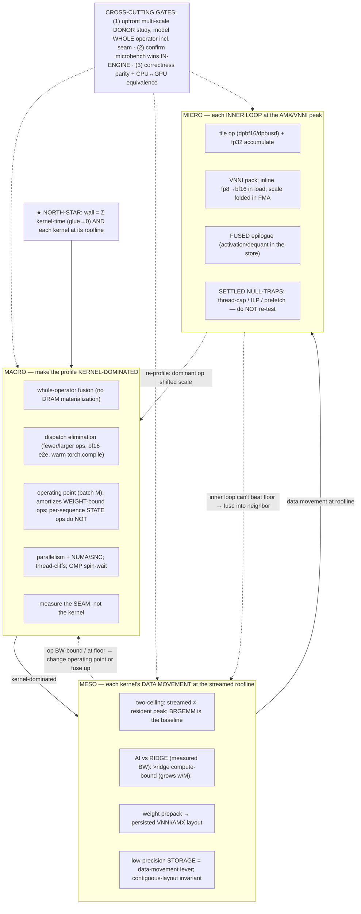

# Performance Scales — a scale-stratified reference for autonomous CPU model perf

A **parallel tree** over the per-technique skills, organizing the SGLang-CPU performance corpus by
the three scales at which lessons actually live, so a NEW model can be carried to best-possible
performance **autonomously** without re-deriving them the expensive way.

## Why this tree exists
The lessons were already in the corpus — but scattered across ~25 per-technique skills and loaded
REACTIVELY, so they were not applied UP FRONT. Result: macro-scale truths (whole-operator fusion,
seam cost, operating point) were missed while reasoning at the micro/meso scale → a roofline proxy
predicted 6–7× for a kernel that delivered 1.07×. This tree makes the multi-scale knowledge an
up-front, enforced flow.

## North-star (the only definition of "done")
1. **Kernel-domination:** `Σ(model-op/kernel time) / wall ≥ ~0.90` — framework/wiring glue → a small
   remainder. 2. **Each dominant kernel at its roofline** for its regime, gap explained. Accuracy is a
hard gate throughout (`accuracy-oracle`).

## The scales + the feedback loops (solid = top-down discovery; dotted = bottom-up feedback)

The dotted edges are the iterative feedback loops (a lower-scale floor re-decides a higher scale) —
see `multiscale-optimization` § ITERATIVE FEEDBACK LOOPS. A single macro→meso→micro pass without
re-profiling + feeding floors back up is the waterfall anti-pattern.

## The tree (traverse TOP-DOWN — fix the biggest scale first)
- **[multiscale-optimization](multiscale-optimization/SKILL.md)** — ENTRY POINT: north-star,
  top-down traversal, GATE 1 (upfront multi-scale donor study + whole-operator/seam model), GATE 2
  (confirm microbench wins in-engine).
- **[macro-scale](macro-scale/SKILL.md)** — make the profile KERNEL-DOMINATED: kill framework/dispatch
  overhead, fuse the WHOLE operator (no materialization), parallelize + NUMA, pick the OPERATING POINT
  (batch M). *Biggest wall-time wins; done first.*
- **[meso-scale](meso-scale/SKILL.md)** — each dominant kernel's DATA MOVEMENT at the streamed-roofline:
  BRGEMM resident-C, cache-tiling, weight prepacking, operand-byte reduction; AI-vs-ridge classifies
  compute-bound (kernel-worthy) vs BW-bound (operating-point-only).
- **[micro-scale](micro-scale/SKILL.md)** — each INNER LOOP at the AMX/VNNI peak: tile op, VNNI packing,
  inline precision conversion, FUSED epilogue; the settled null-traps.

## Scale → leaf-skill map (the per-technique skills remain the detail)
| scale | leaf skills |
|------|-------------|
| macro | `inter-kernel-fusion`, `fusion-analysis`, `openmp-parallelization`, `sub-numa-clustering`, `overhead-attribution`, `runtime-config-tuning`, `cpu-serving-integration` |
| meso | `cache-blocking-tiling`, `weight-prepacking-brgemm`, `kernel-authoring`, `compute-from-native-precision`, `roofline-validation`, `establish-achievable-performance` |
| micro | `amx-vectorization`, `cpu-gemm-amx-bf16`, `quantization-amx-int8`, `uarch-perf-probe` |

Plugs into `cpu-optimization-playbook` (technique routing), `model-enablement-playbook` (enablement
leg), and `model-profile-hotspots` (the roofline-vs-measured + pivot cycle-exit artifact).
