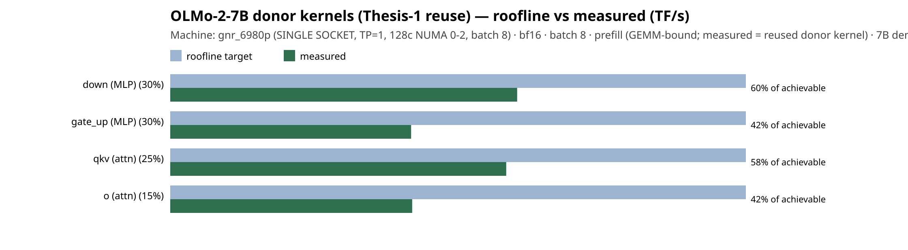
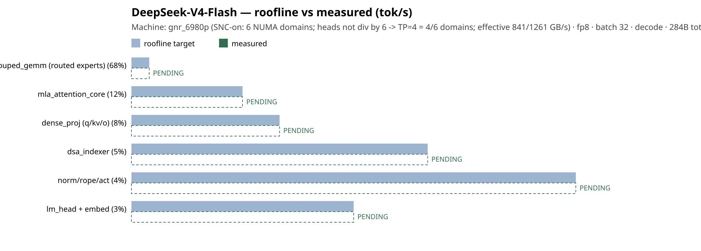
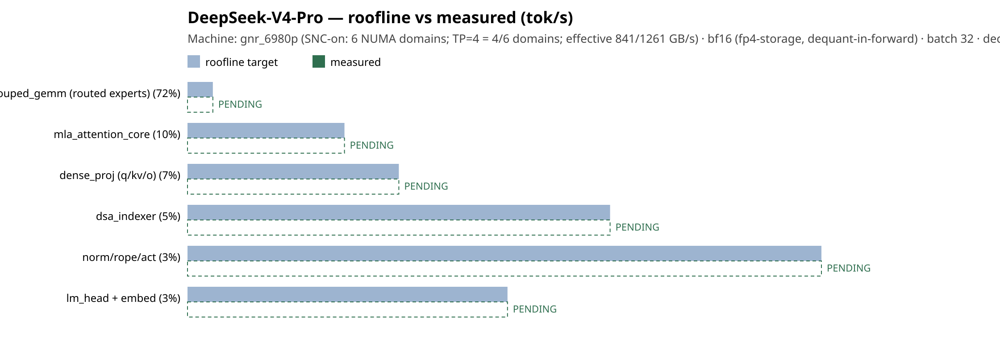

# sglang-cpu-opt — Automated CPU Model Enablement for SGLang

**North Star:** Deliver an AI Systems Performance Engineering Agentic Workflow along with skill files to automate day-0 support for new AI inference models with accuracy and performance.

**How:** An **agentic workflow** (parameterized skill files + agents) that takes a newly
released model and enables **performant, accurate CPU inference** in SGLang on Intel
Xeon (AMX) — as an Intel-maintained **plugin, no fork** — by reusing existing
hand-optimized kernels and proving both correctness and performance.

> **Start here:** [THESIS_SUMMARY.md](THESIS_SUMMARY.md) — the one-page summary.

## Results at a glance (Intel Xeon 6980P / Granite Rapids, single socket)

> **Machine config is matched:** roofline **and** measured below are BOTH **single socket**
> (TP=1, 128c NUMA 0-2, batch 8). We always compare roofline vs measured at the *same* config
> (never single-socket roofline against dual-socket measured).

| Model | Precision | Accuracy (vs HF) | gsm8k | Throughput prefill / decode (tok/s) | Roofline vs measured (1-socket) |
|-------|-----------|------------------|-------|-------------------------------------|---------------------------------|
| OLMo-2-7B (dense) | BF16 | next-token parity 1.0 | 0.60 | 1321 / 91 | GEMM 60.6→18.2 TF (30% of streamed ceiling) · [report](plugin/validate/results/olmo2_7b_bf16_roofline.md) |
| OLMo-2-7B (dense) | INT8 (auto-quantized) | parity 1.0 | 0.61 | 2013 / 135 (~1.5×) | int8 ceiling ~121 TF/socket · report pending |
| OLMoE-1B-7B (MoE) | BF16 | parity 1.0 | 0.19* | 7629 / 251 | MoE decode weight-streaming bound · report pending |

*1B-active base model. Machine-checkable proof: [plugin/certificates/](plugin/certificates).

**Peer-relative performance** (OLMo-2-7B dense GEMMs vs the Llama-3-8B donor on the
identical AMX kernel): `eff_rel` 0.94–1.26 — all PASS. Both BF16 and INT8 were produced
automatically from the same donor kernels (capability inheritance).

## Two theses, one plugin
- **Thesis 1 — throughput (all-known-kernels):** enable by wiring + validation only. **PROVEN** (above).
- **Thesis 2 — new-kernel leg (DeepSeek Flash v4.1):** the workflow, demonstrated end-to-end:
  - **Scope-discovery** surfaced the *true* scope — **two** novel kernel families (DSA sparse
    attention + MHC hash-clustering) **plus** a runtime infra layer — not the "4 DSA kernels" a
    static op-scan implied → [coverage/scope](plugin/coverage/deepseek_v4_flash_coverage.yaml).
  - **Enabled:** the CPU infra layer (KV pool, paged allocator, backend guards, metadata routing)
    and the MLA-core + MHC kernels, **authored reference-first** and checked against in-tree oracles
    (`fused_q_norm_rope`, `fused_k_norm_rope`+fp8-pack+paged-write, MHC sinkhorn/combine) —
    [plugin/intel_cpu_models/_dsv4_cpu_infra.py](plugin/intel_cpu_models/_dsv4_cpu_infra.py).
  - **Feasibility gate** demonstrated on `index_gemm(M16)` (GNR+EMR microbench → data-driven DEFER).
  - **Novel DSA compute kernels authored + parity-validated on CPU** (reference-first, the ops the
    scan flagged as GAP): compressor softmax-pool, lightning-indexer (logits+top-k), sparse-prefill
    attention — [dsa_compressor_cpu.py](plugin/intel_cpu_models/dsa_compressor_cpu.py),
    [dsa_indexer_cpu.py](plugin/intel_cpu_models/dsa_indexer_cpu.py),
    [dsa_sparse_attention_cpu.py](plugin/intel_cpu_models/dsa_sparse_attention_cpu.py) (parity gates PASS).
  - **Composed DSA attention validated end-to-end on CPU** — index→select→attend
    ([dsa_attention_cpu.py](plugin/intel_cpu_models/dsa_attention_cpu.py)): at top-k=all it reduces
    **exactly to dense attention** (err 1.8e-7), proving the whole sparse pipeline is numerically correct.
  - **Remaining (scoped):** the paged flash-MLA *serving* runtime (compress plan byte-layout + state-pool
    ring gather/scatter + paged fp8 cache dequant in the backend forward) to wire these kernels into an
    end-to-end serve, then the real **806 GB Pro** run (weights ready) for perf + accuracy. This is
    CUDA-oriented backend plumbing, not novel-kernel authoring — the novel DSA math is done + proven.

## Roofline target vs measured (published with every result)
Every published result carries the **roofline achievable target** alongside the **measured**
number, plus a **per-op breakdown** of which kernels fall short of their roofline (measured is
usually below target — the gap is the remaining optimization RoI). Target is published up front;
measured fills in when the kernels run. The **same chart serves both legs**: in the **new-kernel
leg (Thesis 2)** measured = *our authored* kernel; in the **reuse leg (Thesis 1)** measured = the
*reused donor* kernel, so the gap shows whether the donor kernels are actually optimized or leave
headroom (an RoI even when no new kernel was written).
- **Thesis 1 — donor-kernel optimization** (OLMo-2-7B, BF16, GNR): [report](plugin/validate/results/olmo2_7b_donor_roofline.md)
  ·  — reused donor GEMMs run at 0.94–1.26× the donor's own efficiency (wiring preserved) yet only **42–60% of the AMX ceiling** → headroom.
- DeepSeek-V4-Flash (decode, fp8, GNR): [roofline vs measured report](plugin/validate/results/deepseek_v4_flash_roofline.md)
  · 
- DeepSeek-V4-Pro (decode, bf16/fp4-storage, GNR): [roofline vs measured report](plugin/validate/results/deepseek_v4_pro_roofline.md)
  · 
- Regenerate from a `model-profile-hotspots` run: `python plugin/validate/roofline_vs_measured.py
  --in <profile.json> --out-prefix plugin/validate/results/<name>`.

## Repository map
- [`.agents/`](.agents) — the workflow: `agents/` (model-enablement, cpu-optimizer) and
  grouped `skills/` — see [`.agents/skills/README.md`](.agents/skills/README.md), which
  marks the **throughput-thesis** skills.
- [`plugin/`](plugin) — generated model classes (`intel_cpu_models/`), generic validators
  (`validate/`), the auto-quantizer (`quantize/`), **certificates** (`certificates/*.yaml`),
  and the DeepSeek coverage analysis (`coverage/*.yaml`).
- [`tools/`](tools) — node calibration + microbenchmarks.

## Reproduce
Each certificate carries its exact `reproduce:` commands. SGLang CPU install:
`sglang/docs/docs/hardware-platforms/cpu_server.mdx`. The validators are generic —
point `--model` / `--config` at any model. Weights are not stored here (downloaded separately).
