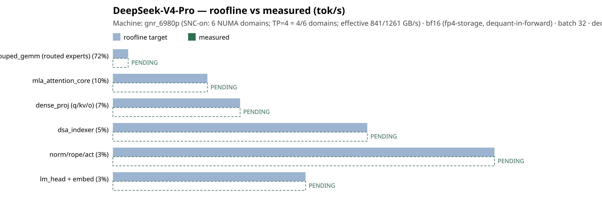

# sglang-cpu-opt — Automated CPU Model Enablement for SGLang

**North Star:** Deliver an AI Systems Performance Engineering Agentic Workflow along with skill files to automate day-0 support for new AI inference models with accuracy and performance.

**How:** An **agentic workflow** (parameterized skill files + agents) that takes a newly
released model and enables **performant, accurate CPU inference** in SGLang on Intel
Xeon (AMX) — as an Intel-maintained **plugin, no fork** — by reusing existing
hand-optimized kernels or creating new kernels (having distilled knowhow into skill files) and proving both correctness and performance.

> **Start here:** [THESIS_SUMMARY.md](THESIS_SUMMARY.md) — the one-page summary.
>
> **Correctness & hygiene, up front:** every enablement clears a fixed gate set *before* any number is published — (1) **dtype hygiene** — each weight family's stored dtype is audited and mapped to a supported compute dtype (low-bit **moved**, bf16 **computed**), and every `stored ≠ compute` dequant bridge is **parity-checked, not assumed**; (2) **coverage-gate** — no novel op is silently dense-approximated; (3) **accuracy oracle** — per-op kernel parity → real-prompt coherence → per-layer parity → task accuracy; (4) **reference oracle (Thesis 2, wherever a GPU + the model are available)** — a GPU reference forward captures per-(layer,op) tensors/logits so CPU bring-up is diffed against ground truth; the first divergent layer localizes integration bugs that per-op checks can't; (5) **honest roofline** — target vs measured at one labeled machine config. Unproven numbers are labeled UNVALIDATED, never implied.
>
> **Bird's-eye view of the agentic workflow & skills** — the staged, measure-first methodology behind the North Star (HW characterization → analysis → roofline → coverage → reuse/author → validate → certify), with all **31 skills** mapped to each stage.

> Interactive version: [docs/agentic-workflow-slide.html](docs/agentic-workflow-slide.html) (open in a browser).

## Two theses, one plugin

Two enablement paths through the same agentic workflow: **Thesis 1** reuses existing AMX kernels
(wiring + validation only); **Thesis 2** authors the missing kernels for a genuinely new architecture.

### Thesis 1 — throughput, all-known-kernels — PROVEN
Results on Intel Xeon 6980P / Granite Rapids, **single socket**:

> **Machine config is matched:** roofline **and** measured below are BOTH **single socket**
> (TP=1, 128c NUMA 0-2, batch 8). We always compare roofline vs measured at the *same* config
> (never single-socket roofline against dual-socket measured).

| Model | Precision | Accuracy (vs HF) | gsm8k | Throughput prefill / decode (tok/s) | Roofline vs measured (1-socket) |
|-------|-----------|------------------|-------|-------------------------------------|---------------------------------|
| OLMo-2-7B (dense) | BF16 | next-token parity 1.0 | 0.60 | 1321 / 91 | GEMM 60.6→18.2 TF (30% of streamed ceiling) · [report](plugin/validate/results/olmo2_7b_bf16_roofline.md) |
| OLMo-2-7B (dense) | INT8 (auto-quantized) | parity 1.0 | 0.61 | 2013 / 135 (~1.5×) | int8 ceiling ~121 TF/socket · report pending |
| OLMoE-1B-7B (MoE) | BF16 | parity 1.0 | 0.19* | 7629 / 251 | MoE decode weight-streaming bound · report pending |

*1B-active base model. Machine-checkable proof: [plugin/certificates/](plugin/certificates).

**Peer-relative performance** (OLMo-2-7B dense GEMMs vs the Llama-3-8B donor on the
identical AMX kernel): `eff_rel` 0.94–1.26 — all PASS. Both BF16 and INT8 were produced
automatically from the same donor kernels (capability inheritance).

### Thesis 2 — new-kernel leg (DeepSeek Flash v4.1)
The workflow, demonstrated end-to-end:

- **Scope-discovery** surfaced the *true* scope — **two** novel kernel families (DSA sparse
  attention + MHC hash-clustering) **plus** a runtime infra layer — not the "4 DSA kernels" a
  static op-scan implied → [coverage/scope](plugin/coverage/deepseek_v4_flash_coverage.yaml). It
  also ran the upfront **data-type audit** — census each weight family's *stored* dtype from the
  real checkpoint (MXFP4 experts, fp8 projections, bf16 rest) and **map it to the target-HW compute
  dtype** (→ W4A16 / W8A16 / native bf16), flagging every `stored ≠ compute` dequant bridge (see the
  precision-hygiene table below).
- **Enabled:** the CPU infra layer (KV pool, paged allocator, backend guards, metadata routing)
  and the MLA-core + MHC kernels, **authored reference-first** and checked against in-tree oracles
  (`fused_q_norm_rope`, `fused_k_norm_rope`+fp8-pack+paged-write, MHC sinkhorn/combine) —
  [plugin/intel_cpu_models/_dsv4_cpu_infra.py](plugin/intel_cpu_models/_dsv4_cpu_infra.py).
- **Feasibility gate** demonstrated on `index_gemm(M16)` (GNR+EMR microbench → data-driven DEFER).
- **Novel DSA compute kernels authored + parity-validated on CPU** (reference-first, the ops the
  scan flagged as GAP): compressor softmax-pool, lightning-indexer (logits+top-k), sparse-prefill
  attention — [dsa_compressor_cpu.py](plugin/intel_cpu_models/dsa_compressor_cpu.py),
  [dsa_indexer_cpu.py](plugin/intel_cpu_models/dsa_indexer_cpu.py),
  [dsa_sparse_attention_cpu.py](plugin/intel_cpu_models/dsa_sparse_attention_cpu.py) (parity gates PASS).
- **Composed DSA attention validated in isolation on CPU** — index→select→attend
  ([dsa_attention_cpu.py](plugin/intel_cpu_models/dsa_attention_cpu.py)): at top-k=all it reduces
  **exactly to dense attention** (err 1.8e-7), proving the sparse-attention math is numerically
  correct (standalone; wiring it into the in-model *incremental* decode path is in Remaining).
- **Runs end-to-end on CPU at tp=1 via native MXFP4** — the routed experts stay 4-bit and run the
  CPU **MXFP4 W4A16** MoE kernel (fused fp4→bf16), so the full model holds **~200 GB → fits ONE
  NUMA/SNC domain → clean tp=1**, sidestepping the tp>1 / NUMA-interleave swamp that an fp4→fp8
  up-convert forced. Loads ~135 s; prefill + multi-token decode complete →
  [run](plugin/validate/run_deepseekv4_flash_mxfp4_tp1.sbatch).
- **FP4→bf16 dtype bridge is parity-checked, not assumed** — the standalone kernel-vs-torch-oracle
  test **PASSES** (cosine 0.999992, rel 5.9e-3 vs an fp32 dequant oracle), verifying the MXFP4
  dequant + VNNI pack + GEMM math; the in-situ real-checkpoint probe (`INTEL_CPU_DSV4_MOE_PARITY`)
  is still queued → [test_mxfp4_moe_cpu.py](plugin/validate/test_mxfp4_moe_cpu.py),
  [dtype_bridge_gates](plugin/coverage/deepseek_v4_flash_coverage.yaml).
- **Accuracy oracle caught a real decode bug** — the real-prompt coherence check found garbage
  output (DSA sparse selection stubbed at decode → MLA gathered nothing → zero attention); fixed
  with a causal **dense fallback**. Full parity + task-accuracy re-run is queued; **decode perf/tok-s
  held UNVALIDATED** until it passes (the earlier fast number was on the pre-fix, attention-off model).
- **Remaining (scoped):** wire the authored DSA kernels into an **incremental-sparse decode**
  (O(context²)→O(context·topk)) + the paged flash-MLA *serving* runtime (compress-plan byte-layout +
  state-pool ring gather/scatter + paged fp8 cache dequant in the backend forward); finish the
  accuracy validation; then the real **806 GB Pro** run (weights ready) for perf + accuracy. This is
  backend plumbing + tuning, not novel-kernel authoring — the novel DSA math is authored + proven in isolation.

**Precision & compute-type hygiene (checked up front, before any kernel is chosen).** GNR AMX has
native matmul tiles for **bf16 / fp16 / int8 only — no fp8 or fp4**. So model discovery audits every
weight family's *stored* dtype (from the real checkpoint, not just `quantization_config`) and maps it
to a *compute* dtype the hardware actually supports: sub-16-bit weights are **moved** low-bit (a
bandwidth/capacity win) and **computed in bf16** after a fused dequant. Every `stored ≠ compute` step
is a dequant **bridge** verified numerically, not assumed:

| Weight family (DeepSeek-V4-Flash) | Stored / moved | Compute (AMX) | Bridge | Lossless? | Correctness gate |
|---|---|---|---|---|---|
| MoE routed experts | **MXFP4** (e2m1 + e8m0 group-32) | **bf16** | W4A16, fused fp4→bf16 in-GEMM | ✅ fp4·2^k exact in bf16 | ✅ [parity](plugin/validate/test_mxfp4_moe_cpu.py) PASS · standalone cos 0.999992 + in-situ real-ckpt cos 0.999995 |
| MLA / indexer / shared-expert proj | **fp8** e4m3 | **bf16** | W8A16, dequant fp8→bf16 | ✅ fp8 levels exact in bf16 | donor fp8 CPU path |
| norms / router / embed / lm_head | bf16 | bf16 | none (native) | — | native |

int8 is the only low-precision AMX *compute* tile; fp4/fp8 route through **bf16** compute (not int8)
to stay lossless — the low precision is spent purely on movement/footprint. Keeping the experts
**native 4-bit** (instead of up-converting fp4→fp8, which doubles the footprint) is what lets the
whole model fit **one NUMA domain at tp=1**. Bridges + status: [dtype_bridge_gates](plugin/coverage/deepseek_v4_flash_coverage.yaml).

## Roofline target vs measured (published with every result)
Every published result carries the **roofline achievable target** alongside the **measured**
number, plus a **per-op breakdown** of which kernels fall short of their roofline (measured is
usually below target — the gap is the remaining optimization RoI). Target is published up front;
measured fills in when the kernels run. The **same chart serves both legs**: in the **new-kernel
leg (Thesis 2)** measured = *our authored* kernel; in the **reuse leg (Thesis 1)** measured = the
*reused donor* kernel, so the gap shows whether the donor kernels are actually optimized or leave
headroom (an RoI even when no new kernel was written).
- **Thesis 1 — donor-kernel optimization** (OLMo-2-7B, BF16, GNR): [report](plugin/validate/results/olmo2_7b_donor_roofline.md)
  ·  — reused donor GEMMs run at 0.94–1.26× the donor's own efficiency (wiring preserved) yet only **42–60% of the AMX ceiling** → headroom. Backend is oneDNN/LIBXSMM BRGEMM (best-in-class inner loop), so the gap is **composition/memory-traffic**, not tile-loop quality.
- **Thesis 2 — new-kernel authoring** · DeepSeek-V4-Flash (decode, fp8, GNR): [roofline vs measured report](plugin/validate/results/deepseek_v4_flash_roofline.md)
  ·  — measured = *our authored* DSA/MoE CPU kernels; the gap to the ceiling is the remaining co-design RoI.
- **Thesis 2 — new-kernel authoring** · DeepSeek-V4-Pro (decode, bf16/fp4-storage, GNR): [roofline vs measured report](plugin/validate/results/deepseek_v4_pro_roofline.md)
  ·  — measured = *our authored* kernels on the 1.6T model.
- Regenerate from a `model-profile-hotspots` run: `python plugin/validate/roofline_vs_measured.py
  --in <profile.json> --out-prefix plugin/validate/results/<name>`.

## Repository map
- [`.agents/`](.agents) — the workflow: `agents/` (model-enablement, cpu-optimizer) and
  grouped `skills/` — see [`.agents/skills/README.md`](.agents/skills/README.md), which
  marks the **throughput-thesis** skills.
- [`plugin/`](plugin) — generated model classes (`intel_cpu_models/`), generic validators
  (`validate/`), the auto-quantizer (`quantize/`), **certificates** (`certificates/*.yaml`),
  and the DeepSeek coverage analysis (`coverage/*.yaml`).
- [`tools/`](tools) — node calibration + microbenchmarks.

## Reproduce
Each certificate carries its exact `reproduce:` commands. SGLang CPU install:
`sglang/docs/docs/hardware-platforms/cpu_server.mdx`. The validators are generic —
point `--model` / `--config` at any model. Weights are not stored here (downloaded separately).
