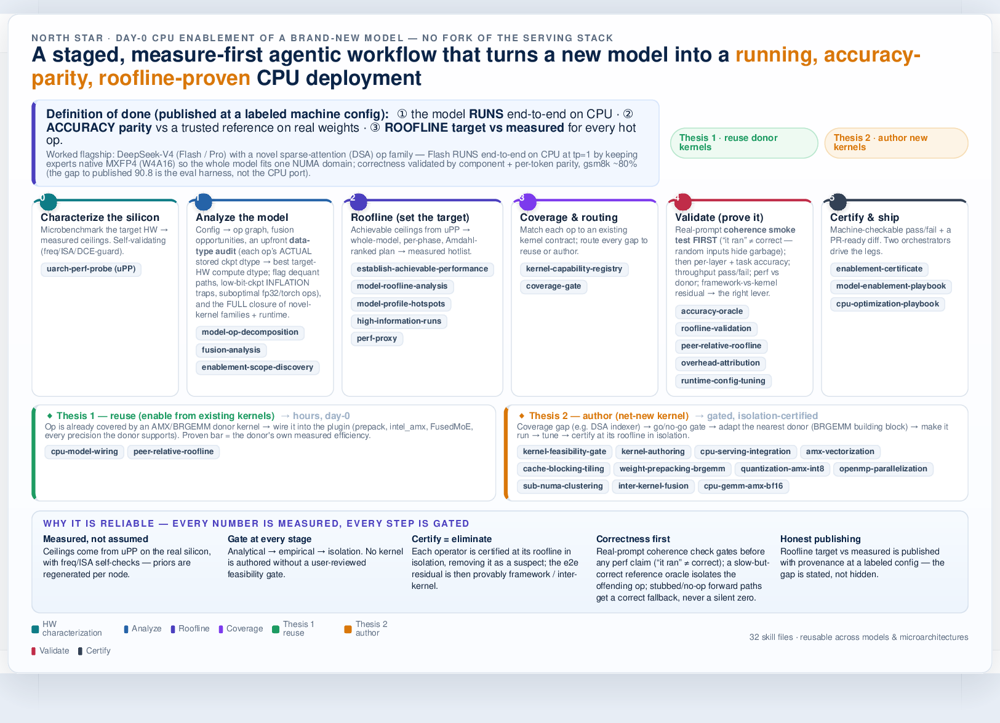
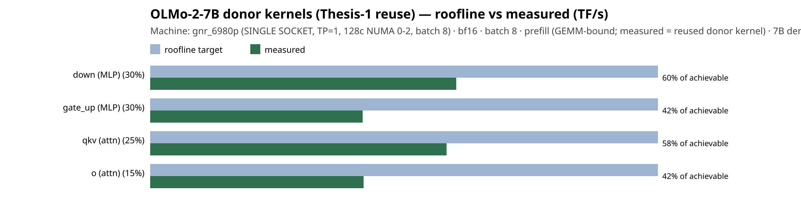
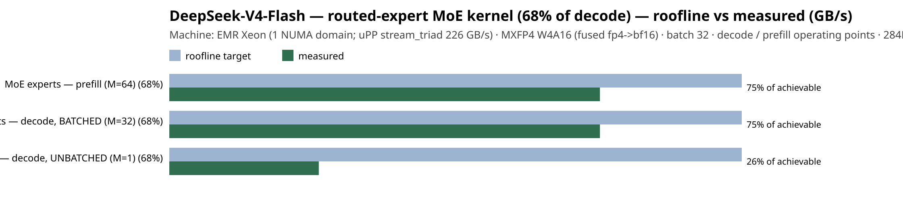

# sglang-cpu-opt — Automated CPU Model Enablement for SGLang

**North Star:** Deliver an AI Systems Performance Engineering Agentic Workflow along with skill files to automate day-0 support for new AI inference models with accuracy and performance.

**How:** An **agentic workflow** (parameterized skill files + agents) that takes a newly
released model and enables **performant, accurate CPU inference** in SGLang on Intel
Xeon (AMX) — as an Intel-maintained **plugin, no fork** — by reusing existing
hand-optimized kernels or creating new kernels (having distilled knowhow into skill files) and proving both correctness and performance.

> **Start here:** [THESIS_SUMMARY.md](THESIS_SUMMARY.md) — the one-page summary.
>
> **Correctness & hygiene, up front:** every enablement clears a fixed gate set *before* any number is published — (1) **dtype hygiene** — each weight family's stored dtype is audited and mapped to a supported compute dtype (low-bit **moved**, bf16 **computed**), and every `stored ≠ compute` dequant bridge is **parity-checked, not assumed**; (2) **coverage-gate** — no novel op is silently dense-approximated; (3) **accuracy oracle** — per-op kernel parity → real-prompt coherence → per-layer parity → task accuracy; (4) **reference oracle (Thesis 2, wherever a GPU + the model are available)** — a GPU reference forward captures per-(layer,op) tensors/logits so CPU bring-up is diffed against ground truth; the first divergent layer localizes integration bugs that per-op checks can't; (5) **honest roofline** — target vs measured at one labeled machine config. Unproven numbers are labeled UNVALIDATED, never implied.
>
> **Bird's-eye view of the agentic workflow & skills** — the staged, measure-first methodology behind the North Star (HW characterization → analysis → roofline → coverage → reuse/author → validate → certify), with all **31 skills** mapped to each stage.

> Interactive version: [docs/agentic-workflow-slide.html](docs/agentic-workflow-slide.html) (open in a browser).

## Two theses, one plugin

Two enablement paths through the same agentic workflow: **Thesis 1** reuses existing AMX kernels
(wiring + validation only); **Thesis 2** authors the missing kernels for a genuinely new architecture.

### Thesis 1 — throughput, all-known-kernels — PROVEN
Results on Intel Xeon 6980P / Granite Rapids, **single socket**:

> **Machine config is matched:** roofline **and** measured below are BOTH **single socket**
> (TP=1, 128c NUMA 0-2, batch 8). We always compare roofline vs measured at the *same* config
> (never single-socket roofline against dual-socket measured).

| Model | Precision | Accuracy (vs HF) | gsm8k | Throughput prefill / decode (tok/s) | Roofline vs measured (1-socket) |
|-------|-----------|------------------|-------|-------------------------------------|---------------------------------|
| OLMo-2-7B (dense) | BF16 | next-token parity 1.0 | 0.60 | 1321 / 91 | GEMM 60.6→18.2 TF (30% of streamed ceiling) · [report](plugin/validate/results/olmo2_7b_bf16_roofline.md) |
| OLMo-2-7B (dense) | INT8 (auto-quantized) | parity 1.0 | 0.61 | 2013 / 135 (~1.5×) | int8 ceiling ~121 TF/socket · report pending |
| OLMoE-1B-7B (MoE) | BF16 | parity 1.0 | 0.19* | 7629 / 251 | MoE decode weight-streaming bound · report pending |

*1B-active base model. Machine-checkable proof: [plugin/certificates/](plugin/certificates).

**Peer-relative performance** (OLMo-2-7B dense GEMMs vs the Llama-3-8B donor on the
identical AMX kernel): `eff_rel` 0.94–1.26 — all PASS. Both BF16 and INT8 were produced
automatically from the same donor kernels (capability inheritance).

### Thesis 2 — new-kernel leg (DeepSeek Flash v4.1)

**DeepSeek-V4-Flash** (284B total / 13B active MoE; 43 layers, 64-head MLA, 256 experts top-6) is the
flagship for the **new-architecture** leg — it carries **two genuinely novel op families** (DeepSeek
Sparse Attention: lightning-indexer + KV-compressor + top-k sparse-MLA; and MHC hash-clustering),
while everything else is covered by the DeepSeek-V2 CPU donors. This section shows two things: the
**repeatable approach** our agentic workflow applies to *any* new architecture, and **what it has
demonstrated** on this model.

#### The approach we built (reusable across models)
- **Coverage-gate routing** — decompose the model, match every op to existing CPU kernels, and route
  *only* the genuinely novel ops to the author leg (here: DSA + MHC); never dense-approximate a gap.
- **Up-front precision / data-type hygiene** — census each weight family's *stored* dtype from the
  **real checkpoint** and map it to a HW-supported *compute* dtype (low-bit **moved**, bf16
  **computed**); every `stored ≠ compute` dequant bridge is **parity-checked, not assumed**.
- **Reference-first kernel authoring** — write each novel kernel against an in-tree numeric oracle and
  gate on parity *before* it enters the serving path. No unverified kernel ships.
- **Performance methodology — cheapest, highest-signal first (the order matters):**
  1. **Rule out systemic-config pathology FIRST.** A single mis-setting (thread cliff, OpenMP
     spin-wait, NUMA bind) inflates *every* op roughly uniformly and dwarfs any per-op tuning — sweep
     it before ranking hotspots. (Here it was worth **63× prefill / 10× decode** on its own.)
  2. **Truncated model + dummy weights.** A depth-reduced, full-**WIDTH** proxy reproduces every
     per-op bottleneck queue-free in ~1/N the time; nearly all fix-iteration lives here.
  3. **Full model + dummy weights.** The authoritative perf-vs-roofline run at full shapes/footprint on
     the target node — *before* paying any real-weight load — catching depth-aggregate + capacity
     effects the proxy can't.
  4. **Full model + real weights.** Paid **only** for accuracy + a final no-regression confirm.
- **Accuracy oracle gates before any perf claim** — real-prompt coherence → per-token parity → task
  accuracy; a failing gate blocks the number (it did here — see below).

#### Demonstrated on DeepSeek-V4-Flash
- **Scope** — scope-discovery surfaced the *true* scope (DSA + MHC **plus** a runtime infra layer, not
  the "4 DSA kernels" a static op-scan implied) → [coverage/scope](plugin/coverage/deepseek_v4_flash_coverage.yaml).
- **Novel kernels authored + parity-validated on CPU** — DSA compressor softmax-pool, lightning-indexer,
  sparse-prefill attention ([compressor](plugin/intel_cpu_models/dsa_compressor_cpu.py),
  [indexer](plugin/intel_cpu_models/dsa_indexer_cpu.py),
  [sparse-attn](plugin/intel_cpu_models/dsa_sparse_attention_cpu.py)) + the MLA-core/MHC/infra layer
  ([_dsv4_cpu_infra.py](plugin/intel_cpu_models/_dsv4_cpu_infra.py)); the **composed** DSA attention
  reduces **exactly to dense at top-k=all** (err 1.8e-7), proving the sparse math
  ([dsa_attention_cpu.py](plugin/intel_cpu_models/dsa_attention_cpu.py)). A `index_gemm(M16)`
  feasibility gate returned a data-driven DEFER — no wrong kernel built.
- **Runs end-to-end at tp=1 by keeping the MXFP4 nibbles** — the routed experts stay **native 4-bit**
  on the CPU **MXFP4 W4A16** MoE kernel (fused fp4→bf16), so the model holds **~200 GB → fits ONE
  NUMA/SNC domain → clean tp=1** (loads ~135 s) → [run](plugin/validate/run_deepseekv4_flash_mxfp4_tp1.sbatch).
- **Correctness PASSES** — the accuracy oracle caught a real decode bug (DSA selection stubbed at
  decode → MLA gathered nothing → zero attention); fixed with a causal **dense fallback**. Per-token
  parity now passes (coherent, correct generations); the MXFP4 bridge is parity-checked standalone
  (cos 0.999992) and in-situ on the real checkpoint (cos 0.999995). gsm8k task accuracy **in flight**.
- **Performance measured** (EMR, tp=1 + decode-cap=8, full 43 layers, batch 32): **prefill 69.6 /
  decode 9.3 tok/s** → [roofline vs measured report](plugin/validate/results/deepseek_v4_flash_roofline.md).

**Key learnings (each distilled into a reusable skill):**
1. **Compute from the native precision — keep the MXFP4 nibbles, never up-convert.** Feeding packed
   fp4 straight to the W4A16 kernel is both a *capacity* win (~200 GB vs ~275 GB → fits one domain →
   tp=1) and *lossless* (fp4·2^k is exact in bf16). Up-converting fp4→fp8 doubled the footprint and
   forced a tp>1 / NUMA-interleave swamp that ran M=1 decode ~330× slower.
2. **Validate the measurement before optimizing.** The entire first per-op profile was an artifact —
   idle OpenMP threads busy-wait by default and thrash each forward. `OMP_WAIT_POLICY=passive
   KMP_BLOCKTIME=0` gave **63× prefill / 10× decode**, bigger than every per-op tweak combined.
3. **Batching is the decode lever.** Continuous batching amortizes weight streaming: **10× aggregate
   decode** (B=1→32); per-token MoE 1.39→0.32 ms (BW efficiency 26%→75%).
4. **tp=1 + thread-cap beats TP for decode.** The model fits one socket, so TP only adds barrier/comm
   cost at decode (tp=2 = 2.8× slower) — TP is a capacity/prefill lever. Authoritative decode config:
   **tp=1 + decode-cap=8**.

**Remaining (scoped):** wire the authored DSA kernels into an **incremental-sparse decode**
(O(context²)→O(context·topk)) + the paged flash-MLA *serving* runtime; finish the gsm8k task-accuracy
run; then **scale Flash's donor kernels to the 1.6T Pro across a multi-socket EMR cluster**
(Kimi-K3-style TP/EP/PP) — Pro is too large for one GNR node at tp=1, so its story is *distribution*,
not new kernels. This is backend plumbing + tuning, not novel-kernel authoring — the DSA math is
authored + proven in isolation.

**Precision & compute-type hygiene (checked up front, before any kernel is chosen).** GNR AMX has
native matmul tiles for **bf16 / fp16 / int8 only — no fp8 or fp4**. So model discovery audits every
weight family's *stored* dtype (from the real checkpoint, not just `quantization_config`) and maps it
to a *compute* dtype the hardware actually supports: sub-16-bit weights are **moved** low-bit (a
bandwidth/capacity win) and **computed in bf16** after a fused dequant. Every `stored ≠ compute` step
is a dequant **bridge** verified numerically, not assumed:

| Weight family (DeepSeek-V4-Flash) | Stored / moved | Compute (AMX) | Bridge | Lossless? | Correctness gate |
|---|---|---|---|---|---|
| MoE routed experts | **MXFP4** (e2m1 + e8m0 group-32) | **bf16** | W4A16, fused fp4→bf16 in-GEMM | ✅ fp4·2^k exact in bf16 | ✅ [parity](plugin/validate/test_mxfp4_moe_cpu.py) PASS · standalone cos 0.999992 + in-situ real-ckpt cos 0.999995 |
| MLA / indexer / shared-expert proj | **fp8** e4m3 | **bf16** | W8A16, dequant fp8→bf16 | ✅ fp8 levels exact in bf16 | donor fp8 CPU path |
| norms / router / embed / lm_head | bf16 | bf16 | none (native) | — | native |

int8 is the only low-precision AMX *compute* tile; fp4/fp8 route through **bf16** compute (not int8)
to stay lossless — the low precision is spent purely on movement/footprint. Keeping the experts
**native 4-bit** (instead of up-converting fp4→fp8, which doubles the footprint) is what lets the
whole model fit **one NUMA domain at tp=1**. Bridges + status: [dtype_bridge_gates](plugin/coverage/deepseek_v4_flash_coverage.yaml).

## Roofline target vs measured (published with every result)
Every published result carries the **roofline achievable target** alongside the **measured**
number, plus a **per-op breakdown** of which kernels fall short of their roofline (measured is
usually below target — the gap is the remaining optimization RoI). Target is published up front;
measured fills in when the kernels run. The **same chart serves both legs**: in the **new-kernel
leg (Thesis 2)** measured = *our authored* kernel; in the **reuse leg (Thesis 1)** measured = the
*reused donor* kernel, so the gap shows whether the donor kernels are actually optimized or leave
headroom (an RoI even when no new kernel was written).
- **Thesis 1 — donor-kernel optimization** (OLMo-2-7B, BF16, GNR): [report](plugin/validate/results/olmo2_7b_donor_roofline.md)
  ·  — reused donor GEMMs run at 0.94–1.26× the donor's own efficiency (wiring preserved) yet only **42–60% of the AMX ceiling** → headroom. Backend is oneDNN/LIBXSMM BRGEMM (best-in-class inner loop), so the gap is **composition/memory-traffic**, not tile-loop quality.
- **Thesis 2 — new-kernel authoring** · DeepSeek-V4-Flash (routed-expert MoE kernel = 68% of decode, MXFP4 W4A16, EMR): [roofline vs measured report](plugin/validate/results/deepseek_v4_flash_roofline.md)
  ·  — **measured**: prefill and *batched* decode hit **75% of the DRAM-BW roofline**; unbatched M=1 decode only **26%** → batching is the decode lever. Model-level (tp=1+cap, full 43 layers, batch 32): prefill 69.6 / decode 9.3 tok/s.
- **DeepSeek-V4-Pro (1.6T) — reuse + scale-out, NOT new-kernel authoring.** Pro is the *same* DSv4
  architecture as Flash (DSA + MHC + MLA + native-MXFP4 MoE), so Flash's authored CPU kernels are its
  **donors** — enabling Pro is Thesis-1-style *wiring + validation*, not new kernels. It is **too large
  for one GNR node at tp=1**: ~800 GB native MXFP4 exceeds a single 256 GB NUMA domain (and the 768 GB
  socket), so it can only run **TP≥2** — the decode-hostile config we measured at 2.8× slower. Its
  realistic home is a **multi-socket EMR cluster** (Kimi-K3-style TP/EP/PP across ~16 sockets) — a
  *distribution* story, not a kernel story. The [analytical roofline](plugin/validate/results/deepseek_v4_pro_roofline.md)
  is an earlier GNR-TP4 estimate kept for reference only; the multi-socket roofline is TBD and no
  single-node Pro run is claimed.
- Regenerate from a `model-profile-hotspots` run: `python plugin/validate/roofline_vs_measured.py
  --in <profile.json> --out-prefix plugin/validate/results/<name>`.

## Repository map
- [`.agents/`](.agents) — the workflow: `agents/` (model-enablement, cpu-optimizer) and
  grouped `skills/` — see [`.agents/skills/README.md`](.agents/skills/README.md), which
  marks the **throughput-thesis** skills.
- [`plugin/`](plugin) — generated model classes (`intel_cpu_models/`), generic validators
  (`validate/`), the auto-quantizer (`quantize/`), **certificates** (`certificates/*.yaml`),
  and the DeepSeek coverage analysis (`coverage/*.yaml`).
- [`tools/`](tools) — node calibration + microbenchmarks.

## Reproduce
Each certificate carries its exact `reproduce:` commands. SGLang CPU install:
`sglang/docs/docs/hardware-platforms/cpu_server.mdx`. The validators are generic —
point `--model` / `--config` at any model. Weights are not stored here (downloaded separately).
