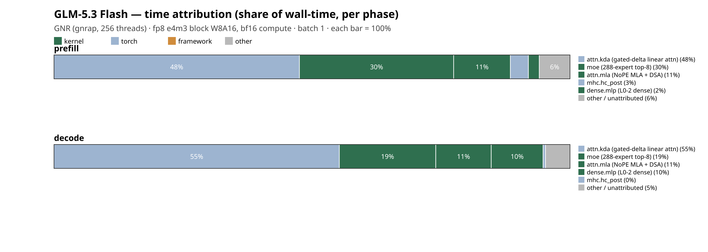

# Time attribution (where the wall-clock goes) — GLM-5.3 Flash

**Node** `GNR (gnrap, 256 threads)` · **fp8 e4m3 block W8A16, bf16 compute** · batch 1 · unit `% of phase wall-time` — each phase sums to 100%.

## prefill

| op | bucket | time (s) | % of phase |
|----|--------|----------|------------|
| attn.kda (gated-delta linear attn) | torch | 3.660 | 47.6 |
| moe (288-expert top-8) | kernel | 2.300 | 29.9 |
| attn.mla (NoPE MLA + DSA) | kernel | 0.845 | 11.0 |
| mhc.hc_post | torch | 0.269 | 3.5 |
| dense.mlp (L0-2 dense) | kernel | 0.162 | 2.1 |
| other / unattributed | other | 0.458 | 6.0 |

## decode

| op | bucket | time (s) | % of phase |
|----|--------|----------|------------|
| attn.kda (gated-delta linear attn) | torch | 2.748 | 55.3 |
| moe (288-expert top-8) | kernel | 0.929 | 18.7 |
| attn.mla (NoPE MLA + DSA) | kernel | 0.534 | 10.7 |
| dense.mlp (L0-2 dense) | kernel | 0.499 | 10.0 |
| mhc.hc_post | torch | 0.024 | 0.5 |
| other / unattributed | other | 0.236 | 4.7 |

> Each bar is one phase, segments = share of that phase's wall-time (sum = 100%). `other / unattributed` = phase wall − sum(wrapped ops); a big slice there means more ops need wrapping before trusting the split.
