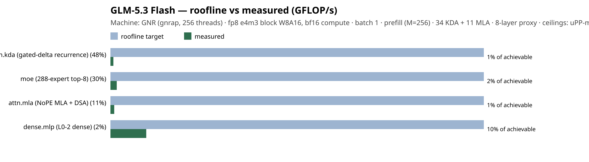

# Roofline target vs measured — GLM-5.3 Flash

**Node** `GNR (gnrap, 256 threads)` · **fp8 e4m3 block W8A16, bf16 compute** · **prefill (M=256)** · batch 1 · unit `GFLOP/s` · **34 KDA + 11 MLA · 8-layer proxy**

**Ceiling provenance:** measured by uPP → `plugin/validate/glm5_prefill_roofline.py (measured GNR AMX bf16 GEMM peak = 14927 GFLOP/s)`

**Model-level:** roofline target **14927.2 GFLOP/s** · measured **178.6 GFLOP/s** · **1% of achievable**

Per-op, ranked by recoverable end-to-end fraction (shortfall × phase share):

| op | phase share % | regime | roofline (GFLOP/s) | measured (GFLOP/s) | efficiency | recoverable % |
|----|---------------|--------|-------------------|-------------------|------------|---------------|
| attn.kda (gated-delta recurrence) | 47.6 | recurrence / small-op | 14927.2 | 118.6 | 1% | 47.2 |
| moe (288-expert top-8) | 29.9 | small-M GEMM | 14927.2 | 252.1 | 2% | 29.4 |
| attn.mla (NoPE MLA + DSA) | 11.0 | small-M attn | 14927.2 | 152.4 | 1% | 10.9 |
| dense.mlp (L0-2 dense) | 2.1 | M=256 GEMM | 14927.2 | 1431.5 | 10% | 1.9 |

> Bars: roofline-achievable (target) vs measured per op. A tall gap on a high-share op is the top optimization RoI. `PENDING` = target published; measured fills in when the kernel runs.

## Reading this (the FLOP ceiling is NOT the reachable target here — unlike DSv4)

The `14927 GFLOP/s` bar is the **dense-GEMM hardware ceiling** (measured GNR AMX bf16 peak). For
DeepSeek-V4 the BW roofline was the *right* target and measured hit **75%** of it. **GLM is different**:
its hot block (`attn.kda`, **47.6%** of prefill) is a **gated-delta recurrence**, not a dense GEMM —
per-chunk / per-head small matmuls that are **dispatch / small-op bound**. Even a native AMX kernel for
it only reaches **parity with the torch compute**, so the `0.09 s` dense-GEMM ceiling is **physically
unreachable** for this workload. The realistic engineering floor is **~4 s** (a fused CPU KDA kernel that
removes the ~768 torch dispatches/prefill), which is **~2.3% of the FLOP ceiling** — and that is the
*true* 100%-of-achievable for a recurrence. So read the per-op `efficiency` column as **"how much of this
block's wall-time is actual GEMM compute vs small-M/dispatch overhead"**, not as "how close to a reachable
target": it **localizes where FLOP-throughput is lost** (small-M KDA / MoE / MLA) against the one
near-efficient block (big-`M` dense MLP, ~10×).

**What the optimization cycle actually delivered** (see the journey chart,
[glm5_flash_prefill_journey.png](./glm5_flash_prefill_journey.png)): **55.5 s → 7.7 s = 7.2×**, *faithful*
(prefill+decode parity: logits cos 0.9999, identical decode tokens). Two bit-exact wins — router
`27 → 0.1 s` (warm the CPU `@torch.compile` at init; **not** an eager bypass, which flips a borderline
`topk` expert) and KDA `24.6 → 3.7 s` (per-token scan → chunk-parallel WY matmuls). The **remaining RoI**
is the fused KDA kernel (7.7 s → ~4 s) — dispatch elimination, **not** chasing the dense-GEMM ceiling.
